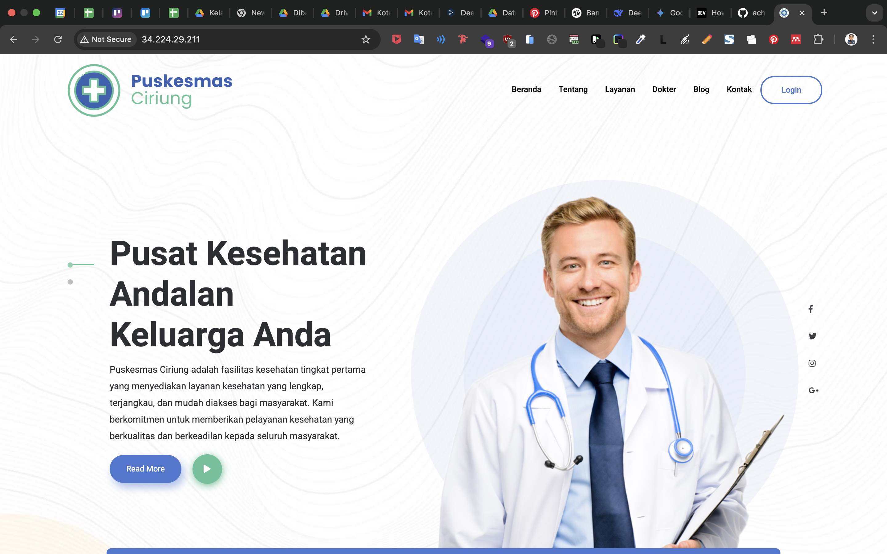
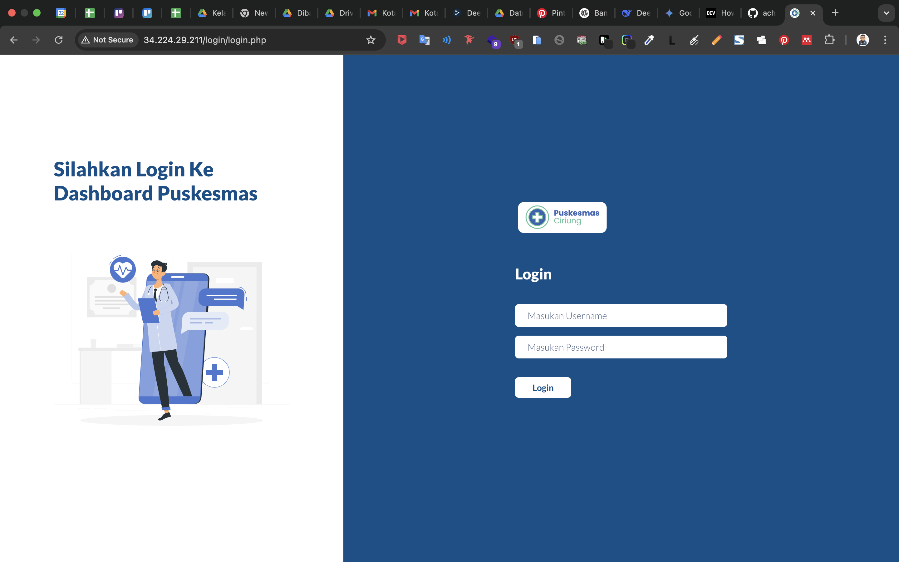
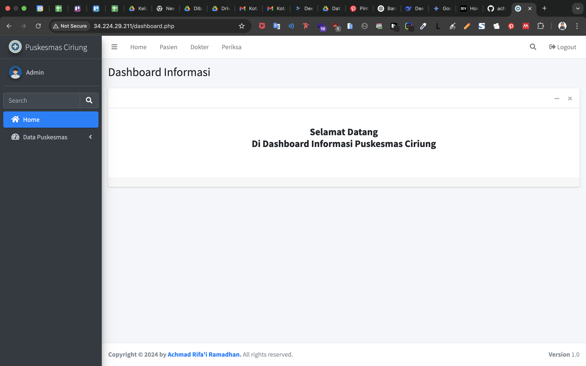
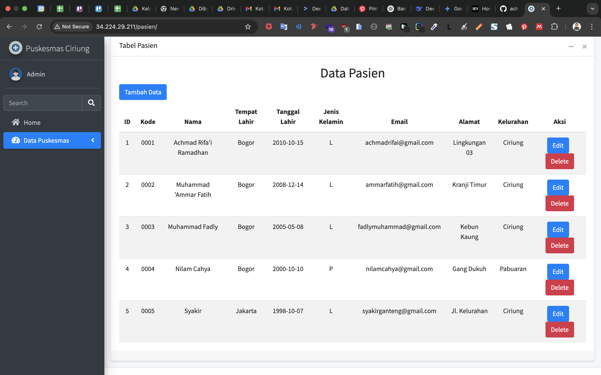
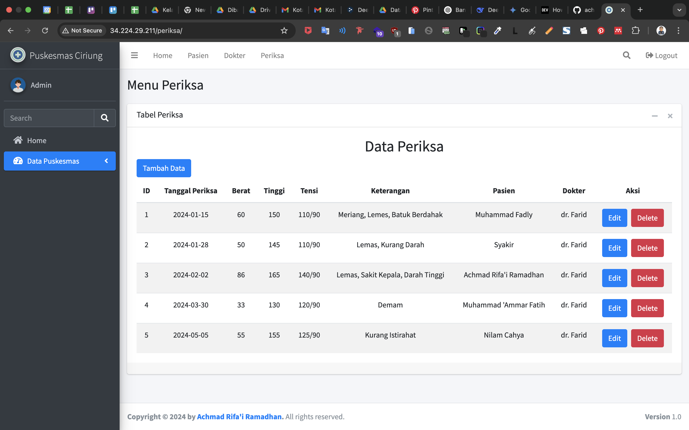

# 🏥 Sistem Informasi Manajemen Puskesmas

Proyek ini adalah aplikasi web berbasis **PHP Native** yang dirancang untuk membantu pengelolaan data di lingkungan **Puskesmas** (Pusat Kesehatan Masyarakat). Sistem ini memiliki fitur **CRUD lengkap** (Create, Read, Update, Delete) untuk berbagai entitas penting seperti pasien, dokter, dan data pemeriksaan.

Proyek ini memberikan saya pengalaman berharga dalam membangun sistem manajemen data menggunakan teknologi dasar web, serta memperkuat pemahaman saya tentang konsep **pengelolaan data, validasi form, dan struktur database relasional.**

---

## ✨ Fitur Utama

- 👨‍⚕️ **Manajemen Data Pasien**  
  Menyimpan dan menampilkan informasi pasien secara lengkap, seperti:
  - Nama lengkap
  - Alamat
  - Tanggal lahir
  - Riwayat medis

- 👩‍⚕️ **Manajemen Data Dokter**  
  Menyimpan dan menampilkan informasi dokter seperti:
  - Nama dokter
  - Spesialisasi
  - Jadwal praktik

- 📋 **Manajemen Data Pemeriksaan**  
  Menyimpan data hasil pemeriksaan pasien, meliputi:
  - Tanggal pemeriksaan
  - Jenis pemeriksaan
  - Hasil pemeriksaan

- 🔐 **Login & Otentikasi Admin**  
  Sistem login untuk mengamankan akses ke sistem manajemen data.

- 📊 **Dashboard Admin Sederhana**  
  Menampilkan ringkasan jumlah data pasien, dokter, dan pemeriksaan.

---

## 🌐 Demo Aplikasi

- 🚀 **Live Hosting**:  
  [https://lnkd.in/g_PPU6CU](https://lnkd.in/g_PPU6CU)

- 🎥 **Demo Video**:  
  [https://lnkd.in/g_xpiD_v](https://lnkd.in/g_xpiD_v)

- 🔑 **Login Akses**:
  - 👤 **Username**: `admin`  
  - 🔒 **Password**: `admin`

---

## ⚙️ Teknologi yang Digunakan

- 🌐 **HTML5**
- 🎨 **CSS3 + Bootstrap**
- 🖥️ **AdminLTE** – Template dashboard admin
- 💻 **PHP Native (Tanpa Framework)**
- 🗃️ **MySQL** – Sistem database

---

## 📸 Cuplikan Tampilan

## 🙋‍♂️ Pengalaman & Pembelajaran

💡 Dalam proyek ini saya belajar tentang:

* Struktur dasar pengembangan web tanpa framework
* Validasi input form manual
* Query SQL dasar (SELECT, INSERT, UPDATE, DELETE)
* Keamanan dasar: session login, SQL Injection prevention (menggunakan prepared statements)

---

## 👨‍💻 Kontributor

Proyek ini dikembangkan oleh:

- 📸 **Instagram**: [@rifairmdhnn_](https://instagram.com/rifairmdhnn_)
- 💼 **LinkedIn**: [Achmad Rifa'i Ramadhan](https://www.linkedin.com/in/achmadrifairamadhan/)

---

## ☕ Dukung Kami

Jika proyek ini bermanfaat bagi Anda, dukung pengembangannya melalui:

- ☕ [Buy Me a Coffee](https://lynk.id/rifairmdhnn_)

---

## 📄 Lisensi

Proyek ini dilisensikan di bawah [MIT License](LICENSE).

---